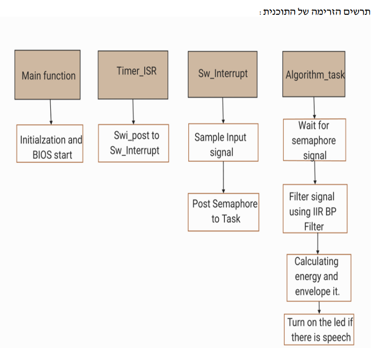
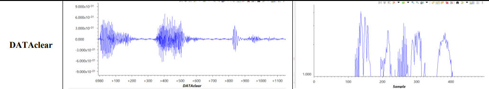
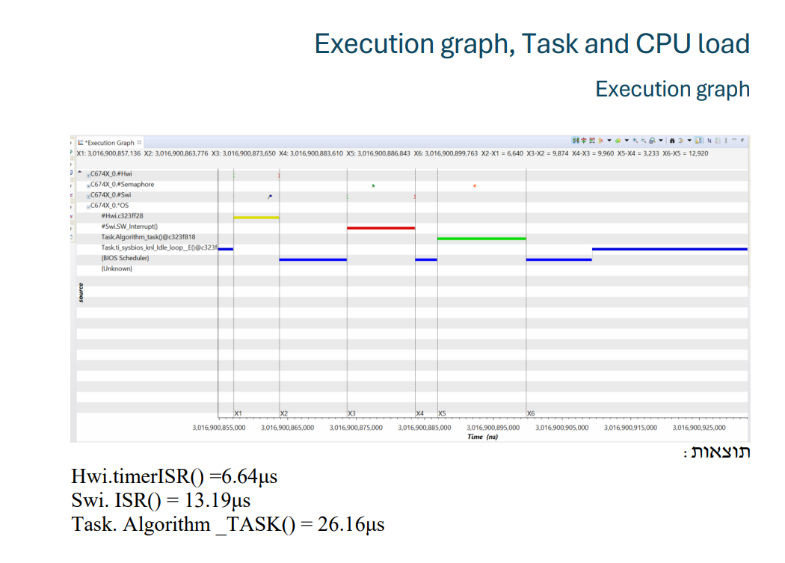

# Speech Detection in Real-Time  
Final Project for DSP Course  

## 📜 Project Description

This project implements a **real-time speech detection system** based on signal processing techniques.  
The system processes a real-time audio signal, filters noise, calculates energy envelopes, and determines if speech is present. A visual LED indicator responds to speech detection.

Developed during the **DSP Processors Programming** course at the Department of Electrical and Electronics Engineering.

---

## 🎯 Project Requirements

- Real-time signal acquisition at **1kHz** sample rate.
- Continuous signal sampling using a hardware timer (no gaps).
- Bandpass filter: **140Hz–420Hz** range using a **4th-order IIR elliptic filter** designed in MATLAB.
- Compute the **absolute value** of the filtered signal.
- Detect speech using a **dynamic threshold** based on signal energy.
- LED visual feedback:
  - LED ON = speech detected.
  - LED OFF = no speech detected.
- Display:
  - Original signal.
  - Filtered signal.
  - Frequency spectrum (FFT).
  - Task Execution Graph, CPU Load, and Task Load.

---

## 🛠 Tools and Resources

- **Code Composer Studio (CCS)**: Code execution and debugging.
- **MATLAB Filter Designer**: Design of the 4th-order IIR elliptic bandpass filter.
- **Base Code**: Adapted from `GPIO_LedBlink` lab.
- **Input File**: Provided signal file `Speech_fs_1KHz.h`.

---

## 🧩 Software Architecture

- **HWI (Hardware Interrupt)**: Samples the signal via timer0.
- **SWI (Software Interrupt)**: Preprocesses the sampled data.
- **Task**: Full signal processing: filtering, envelope calculation, and speech detection.

RTOS elements used: `Semaphore`, `HWI`, `SWI`, `Task`.

**Block Diagram**:  

---

## 🧠 Design Considerations

- **Filter Choice**:
  - Chose **IIR Elliptic filter** for sharp transitions and computational efficiency.
- **Envelope Calculation**:
  - Used absolute value and smoothing technique.
- **Thresholding**:
  - Dynamic threshold adjusted based on real-time signal energy levels.
- **Resource Management**:
  - Task prioritization and load balancing using RTOS tools.

---

## 🏃 Results and Graphs

- **Original signal**, **filtered signal**, **FFT spectrum**.
- **Execution Graph**:

- **Data Clear**:

- **Task Load and CPU Load Graphs**:

---

## ⚡ Challenges Faced

- Fine-tuning the bandpass filter to match exactly 140Hz-420Hz.
- Designing an accurate dynamic threshold for different noise conditions.
- Handling RTOS configurations and debugging CCS environment issues.

---

## 🧠 What We Learned

- Practical DSP implementation in real-time systems.
- Usage of CCS and MATLAB for DSP applications.
- Importance of resource optimization and efficient coding.
- Real-time OS concepts: Semaphores, Tasks, Interrupts.

---

## 📚 References

- Course lectures and exercises (Instructor: Yitzhak Kroin).
- [TI RTOS Overview](https://software-dl.ti.com/lprf/simplelink_cc13x0_sdk/1_30_00_06/exports/docs/ti154stack/ti154stack-sdg/ti154stack-sdg/tirtos/rtos-overview.html)
- [Difference Between FIR and IIR Filters - GeeksforGeeks](https://www.geeksforgeeks.org/difference-between-fir-filter-and-iir-filter/)
- [What Is Speech Recognition? - IBM](https://www.ibm.com/think/topics/speech-recognition)
- [Envelope Analysis - Sensemore](https://sensemore.io/envelope-analysis/)

---

## 👥 Authors

- **Maria Nakhle**
- **Sanaa Atamna**

